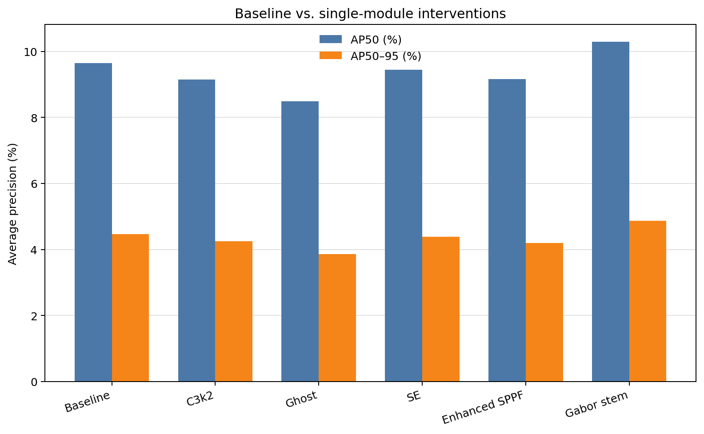
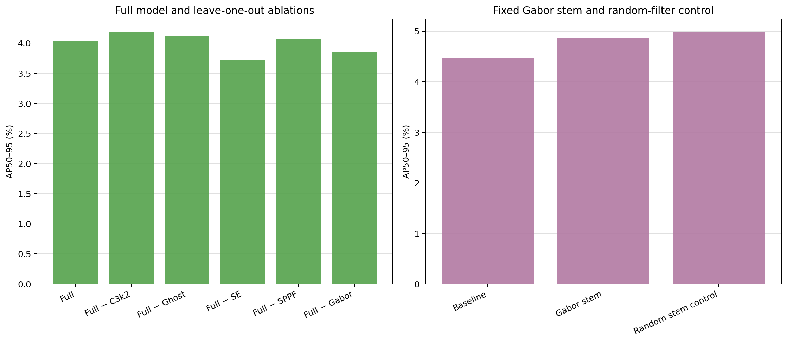
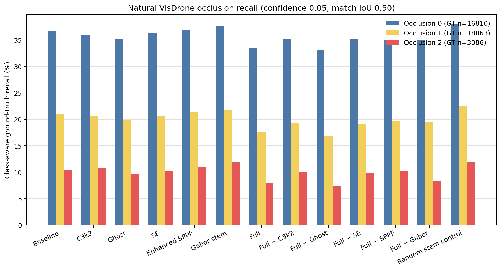
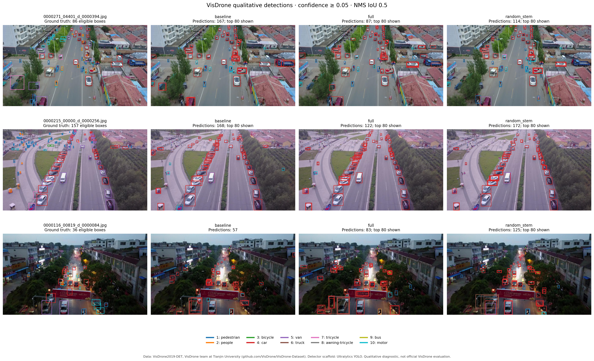

# VisDrone module migration experiments

This repository studies whether feature-extraction modules from an occluded-MNIST
project transfer usefully to ten-class object detection on VisDrone2019-DET. The
detector uses the YOLOv8n training, detection-head, localization, classification,
and distribution-focal-loss machinery. The MNIST comparison head, global pooling,
left/right label swapping, and feature-norm ranking loss were intentionally left
behind because they do not define a corresponding object-detection intervention.

The repository contains two experiment generations:

- The completed 13-arm `pilot` migration study evaluates the modules that were
  active in the original course model, plus ablations and a matched random-filter
  control.
- The six-arm `module_extension` study compares five additional efficient-module interventions with
  a freshly trained baseline. It is currently **in progress**; no extension
  metrics are reported yet.

Implementation details for the extension modules are documented in
[NEW_MODULES.md](docs/NEW_MODULES.md). Source attribution and licenses are recorded
in [ATTRIBUTION.md](docs/ATTRIBUTION.md),
[classic_module_sources.json](docs/classic_module_sources.json), and
[WTConv](docs/wtconv_sources.json) and [LSConv](docs/lsconv_sources.json) source
records.

## Completed pilot: protocol and results

All 13 pilot runs completed under one fixed protocol: 2,048 training images, all
548 validation images, 10 epochs, 512-pixel input, batch size 16, seed 179, and
training from scratch. The downloaded source data contain all 8,629 images across
train, validation, and test-dev; test-dev was not used for training, checkpoint
selection, or reported metrics. Dataset provenance is stored in
[source_provenance.json](results/data/source_provenance.json).

AP values below are percentages. The preregistered primary metric is validation
AP50-95.

| Pilot arm | AP50 | AP50-95 | Parameters |
| --- | ---: | ---: | ---: |
| Baseline | 9.643 | 4.471 | 3,012,798 |
| C3k2 | 9.145 | 4.249 | 3,010,478 |
| Ghost | 8.484 | 3.859 | 2,499,310 |
| SE | 9.447 | 4.386 | 3,012,960 |
| Enhanced SPPF | 9.159 | 4.200 | 3,012,798 |
| Gabor stem | 10.296 | 4.866 | 3,012,878 |
| Full five-module model | 8.764 | 4.044 | 2,497,232 |
| Full minus C3k2 | 9.083 | 4.194 | 2,499,552 |
| Full minus Ghost | 8.506 | 4.119 | 3,010,720 |
| Full minus SE | 8.288 | 3.726 | 2,497,070 |
| Full minus Enhanced SPPF | 8.953 | 4.069 | 2,497,232 |
| Full minus Gabor | 8.421 | 3.853 | 2,497,152 |
| Matched random-filter stem | **10.491** | **4.991** | 3,012,878 |

The random-filter control produced the highest AP50-95 in this run. Gabor exceeded
the baseline by 0.395 percentage points, but the matched random filters exceeded
Gabor by 0.125 points. The evidence therefore does not isolate a benefit from the
Gabor prior itself. It suggests only that the fixed-filter stem intervention may
have helped under this particular short training budget.

The full model used about 17.1% fewer parameters and 10.7% fewer counted
convolution/linear FLOPs than the baseline, while its AP50-95 was 0.428 points
lower. In the leave-one-out runs, removing SE or Gabor reduced the full model's
score, while removing C3k2, Ghost, or Enhanced SPPF increased it slightly. These
are context-dependent interactions within the combined model, not independent
module effects.

The complete evidence is available in the [generated report](results/pilot/REPORT.md),
[summary CSV](results/pilot/summary.csv), [research findings](docs/FINDINGS.md),
[verification record](results/pilot/verification.json), and
[artifact manifest](results/artifact_manifest.json). The released checkpoints are
under `checkpoints/pilot/`.









## What was migrated

The pilot deliberately migrated feature extraction rather than the entire MNIST
task. Its interventions occupy different architectural locations:

| Factor | Detector intervention |
| --- | --- |
| C3k2 | Replace the early backbone C2f at layer 2 |
| Ghost | Replace backbone C2f stages at layers 4, 6, and 8 |
| SE | Apply channel attention after the layer-2 backbone block |
| Enhanced SPPF | Replace the backbone SPPF at layer 9 |
| Gabor | Replace the input stem with a fixed analytic filter bank plus learned projection |
| Random control | Use the same stem shape and normalization with fixed seeded random filters |

This placement difference is a real experimental confound: the pilot compares
complete interventions, not one interchangeable operator inserted at one common
site. Some variants also replace an entire C2f wrapper while others wrap or replace
only a stem or pooling stage. Parameter count, receptive field, normalization,
depth, and optimization path can therefore change together.

The extension study narrows this issue. PConv, Star, WTConv, and large-small
convolution blocks replace the internal units of otherwise retained C2f wrappers
at backbone layers 4, 6, and 8. The GhostConv arm instead replaces four stride-2
downsampling convolutions, so comparisons involving GhostConv still include a
placement and wrapper difference. See [NEW_MODULES.md](docs/NEW_MODULES.md) for the
exact definitions and source provenance.

## The original Gabor initialization bug

In the historical MNIST code, the Gabor convolution weights were created and
frozen, but a later generic model initializer applied Xavier initialization to
convolution modules. Setting `requires_grad=False` prevents optimizer updates; it
does not protect a tensor from an explicit initialization function. Consequently,
the layer described as Gabor no longer contained the intended analytic filters by
the time training began.

This migration corrects that problem by storing the analytic bank as a persistent
buffer and applying it with a functional convolution before a learned projection.
Generic module initialization and optimizers cannot overwrite that buffer. A
normalized fixed random bank with identical shape provides the necessary control.
Because this is a correction, the detector experiment does not reproduce the
historical MNIST checkpoint's actual computation.

## Module extension study: in progress

The planned matrix contains six arms: `baseline`, `ghostconv`, `pconv`, `star`,
`wtconv`, and `lsconv`. Every arm is being trained from scratch for 10 epochs on
the same 2,048 training images and 548 validation images, at image size 512 and
batch size 16, using seeds 179, 2026, and 3407. The baseline is rerun under the new
code rather than copied from the pilot, because code identity is part of the
experimental protocol.

| Extension arm | Seeds completed | AP50-95 mean ± sample SD | Status |
| --- | ---: | ---: | --- |
| Baseline | — | — | In progress |
| GhostConv | — | — | In progress |
| PConv / FasterBlock | — | — | In progress |
| StarBlock | — | — | In progress |
| WTConv | — | — | In progress |
| LSConv (large-small convolution) | — | — | In progress |

No placeholder metric should be interpreted as a result. This table will be filled
only from completed, fingerprint-validated records in `results/module_extension/`.
With three seeds, the report will show the sample standard deviation as a compact
description of run-to-run variation. Three observations are too few to support a
reliable normal-theory 95% confidence interval, so SD must not be presented as one.

## Reproducing the experiments

Use the repository virtual environment explicitly. On Windows PowerShell:

```powershell
py -3.10 -m venv .venv
# Install a CUDA-enabled PyTorch build suitable for your GPU in this environment first.
.\.venv\Scripts\python.exe -m pip install -r requirements.txt
.\.venv\Scripts\python.exe -m unittest discover -s tests -v
.\.venv\Scripts\python.exe scripts\download_data.py
.\.venv\Scripts\python.exe scripts\prepare_data.py --train-limit 2048 --seed 179
```

The archived pilot was produced from source commit `af2026e`. Current core code
contains the extension modules, so it has a different training fingerprint and
must not be used to append runs to the archived `pilot` suite. Create an isolated
worktree at the recorded source commit and use a fresh suite name:

```powershell
git worktree add ..\VisDrone-pilot-reproduction af2026e
Push-Location ..\VisDrone-pilot-reproduction
py -3.10 -m venv .venv
# Install a CUDA-enabled PyTorch build suitable for your GPU first.
.\.venv\Scripts\python.exe -m pip install -r requirements.txt
.\.venv\Scripts\python.exe scripts\prepare_data.py --raw-root ..\VisDrone\data\raw --train-limit 2048 --seed 179
.\.venv\Scripts\python.exe scripts\run_suite.py --suite pilot_reproduction --epochs 10 --imgsz 512 --batch 16 --seeds 179 --expected-train 2048 --expected-val 548
.\.venv\Scripts\python.exe scripts\report.py --suite pilot_reproduction
Pop-Location
```

The extension suite uses the current source and a new archive name:

```powershell
.\.venv\Scripts\python.exe scripts\run_suite.py --suite module_extension_reproduction --variants baseline ghostconv pconv star wtconv lsconv --epochs 10 --imgsz 512 --batch 16 --seeds 179 2026 3407 --expected-train 2048 --expected-val 548
.\.venv\Scripts\python.exe scripts\postprocess_suite.py --suite module_extension_reproduction --check-current-code
```

The published extension run uses `module_extension`; reproduction uses
`module_extension_reproduction` so immutable evidence is never silently reused or
overwritten. `run_suite.py` verifies dataset counts and records the dataset YAML,
preparation manifest, data-content fingerprint, training-code fingerprint, and
environment versions. If any identity field differs, it refuses to reuse the
suite. `runs/` stores complete trainer output, `results/` stores metrics and epoch
CSVs, `checkpoints/` stores the selected validation checkpoints, and `assets/`
contains plots generated from recorded results.

To verify the archived pilot evidence and regenerate diagnostics:

```powershell
.\.venv\Scripts\python.exe scripts\verify_results.py --suite pilot --expected-runs 13
.\.venv\Scripts\python.exe scripts\visualize_predictions.py --weights checkpoints\pilot\baseline_s179.pt checkpoints\pilot\full_s179.pt checkpoints\pilot\random_stem_s179.pt --labels baseline full random_stem --output assets\pilot\predictions.png
.\.venv\Scripts\python.exe scripts\evaluate_occlusion.py --weights checkpoints\pilot\baseline_s179.pt --output results\pilot\baseline_s179\occlusion.json
```

The occlusion diagnostic uses confidence 0.05 and matching IoU 0.5. Image
selection does not depend on predictions. Run it separately for each checkpoint
and regenerate the report after all records are present.

To use all 6,471 training images for a later study, prepare the data with
`--train-limit 0` and choose another suite name. The 1,610 downloaded test-dev
images remain excluded unless a separate evaluation protocol explicitly uses
them.

## Interpretation and research reflection

The pilot is an engineering and hypothesis-generation study under a fixed small
budget. Ten epochs from scratch are not a convergence study. Twelve of the 13
pilot arms selected their checkpoint at epoch 10, which is direct evidence that
the observed ranking may reflect early optimization speed rather than stable
final performance. The validation set is used both for checkpoint selection and
reporting, and there is no independent test score.

The pilot also has only one seed. Differences of a few tenths of a percentage
point therefore have no uncertainty estimate and must not be called statistically
significant. The three-seed extension improves visibility into seed sensitivity,
but its sample SD remains descriptive and is not a 95% confidence interval.

The primary metric is AP50-95 on ten-class labels converted to YOLO format. The
conversion excludes ignored regions, score-zero annotations, and non-target
categories, while the validator does not implement the official VisDrone ignored-
region matching behavior. These numbers must not be presented as official
VisDrone challenge scores.

The strongest lesson from the pilot is methodological. A named prior should be
tested against a matched structural control: without the random-filter arm, the
Gabor result could easily have been overinterpreted. Likewise, module comparisons
need aligned placement and wrappers before architectural names can explain an
observed difference. Longer training, more seeds, a held-out evaluation protocol,
and controlled insertion points are required before making performance claims.

The code is distributed under AGPL-3.0. VisDrone images and annotations retain
their original dataset terms and are not bundled in this repository.
