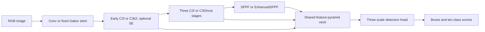

# Model transfer

The shared detector is the three-scale (P3/8, P4/16, P5/32) YOLOv8n architecture
with a ten-class detection head. Graph indices stay fixed: each replacement carries
the original layer index and input references, and the neck/head topology is identical.

| Factor | Intervention | Original behavior retained |
| --- | --- | --- |
| `c3k2` | Replace backbone layer 2 C2f with local C3k2 | LeakyReLU, local bottleneck composition |
| `ghost` | Replace backbone C2f layers 4, 6, 8 with local C3Ghost | Cheap depthwise features and CSP branches |
| `se` | Apply SE after backbone layer 2 | Global channel gating, reduction 16 |
| `sppf` | Replace layer 9 SPPF with EnhancedSPPF | Parallel pooling kernels 3, 5, 7; residual branch sums |
| `gabor` | Replace RGB stride-2 stem | Corrected analytic filter prior, adapted to RGB detection |

The drawing is conceptual; exact skip connections are defined by the upstream
YOLOv8n YAML and preserved by `visdrone_migration/model.py`.

## Gabor correction and control

The original network's global initializer overwrote its analytic kernels with
random values. The new stem stores 32 filters as a persistent buffer, so generic
module initializers and optimizers cannot overwrite the bank. The filters use four
scales and eight orientations, are centered and normalized per spatial filter,
replicated over RGB and divided by three, and applied with stride 2. A trainable
1×1 convolution, BatchNorm and LeakyReLU project them into the original stem width.

`random_stem` uses exactly the same stem geometry and trainable projection with a
seeded, centered, normalized random filter bank. Comparing `gabor` against this
control tests the choice of filter bank. Comparing against `baseline` tests the
whole replacement stem, which also changes capacity and receptive field.

All unchanged layers are initialized identically at a given seed. Each replaced
location has a separate deterministic CPU initialization stream. This makes a
module's initial weights identical in its single-factor and combined variants,
while preserving the global training RNG state.

Parameter counts include trainable and frozen parameters; the fixed filter bank
is separately represented as a buffer. Reported GFLOPs count convolution and linear
MACs twice and include the functional fixed-bank convolution. BatchNorm, activation,
pooling, decode and NMS operations are excluded from this estimate.
