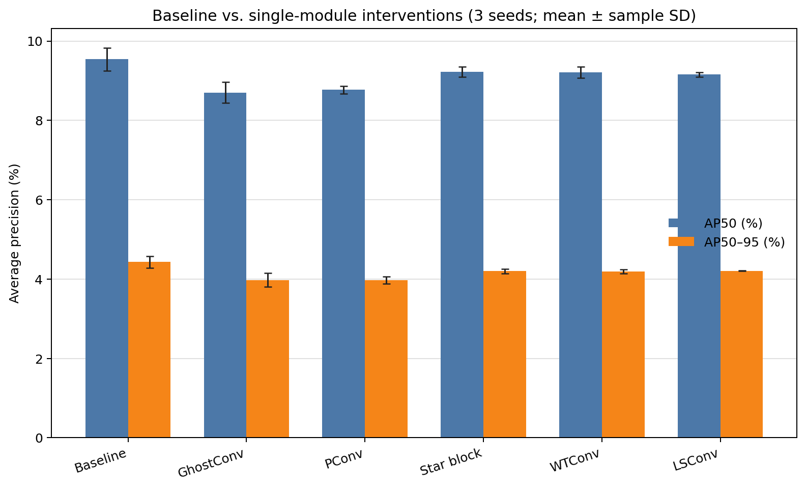
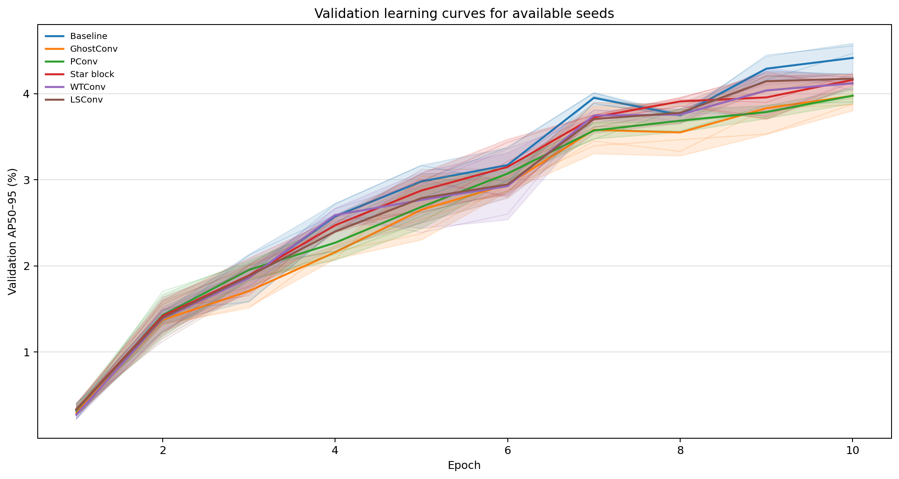
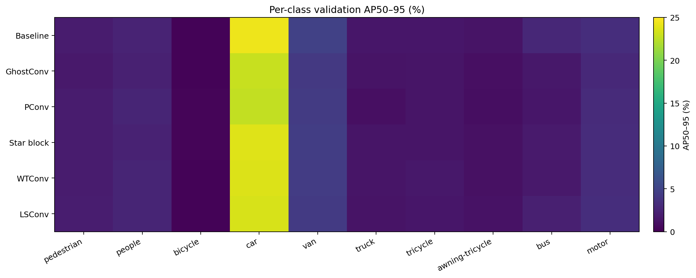
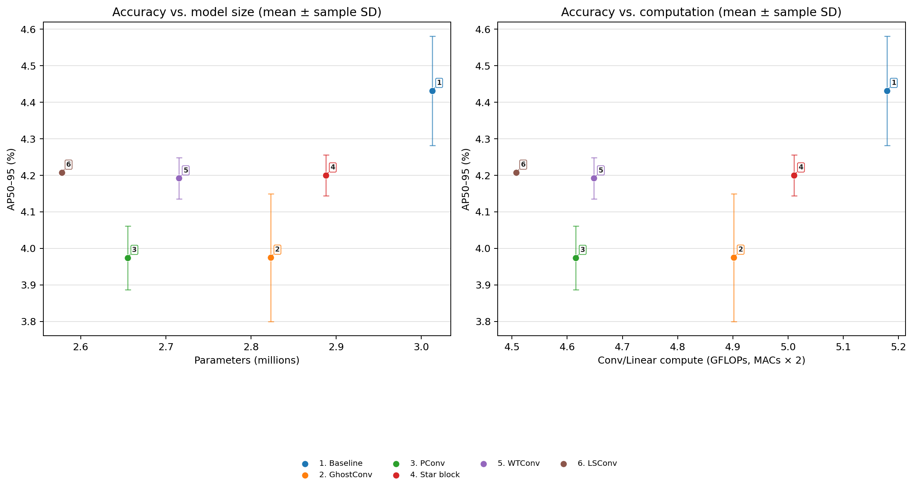
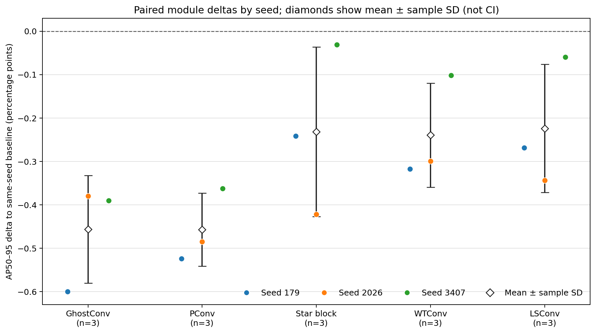
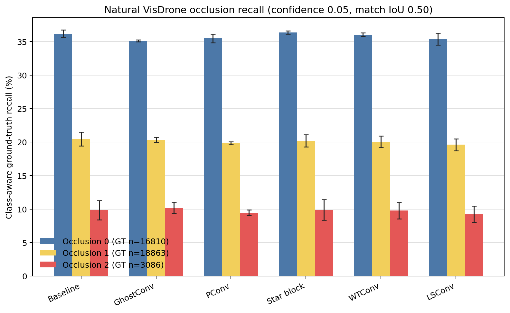
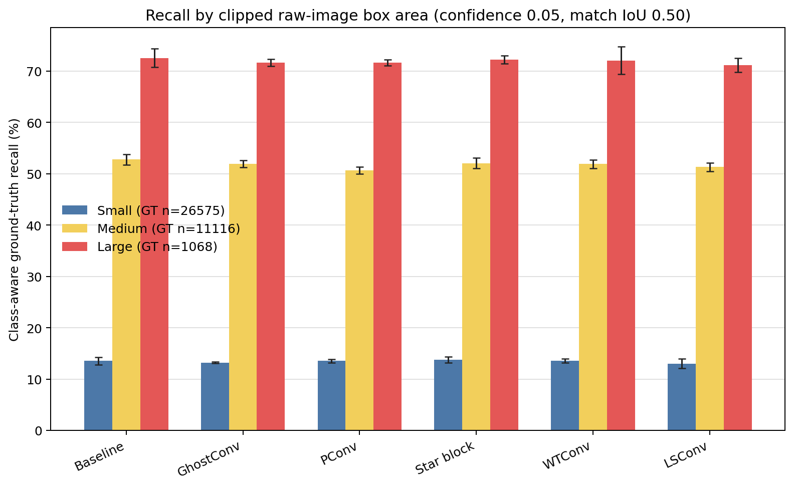

# VisDrone detection experiment report: module_extension

This report aggregates only real records marked `status=completed`. AP values are percentages. Validation uses the converted ten-class YOLO labels and does not implement the official VisDrone ignored-region matching rules, so these values are not official VisDrone DET leaderboard scores.

> Suite status: 18/18 protocol runs completed.

## Aggregate results

| Variant | Runs | Seeds | Precision (%) | Recall (%) | AP50 (%) | AP50–95 (%) | Parameters | Accounted GFLOPs¹ | Validator inference (ms/image)² |
|---|---:|---|---:|---:|---:|---:|---:|---:|---:|
| Baseline | 3 | 179, 2026, 3407 | 21.41 ± 6.58 | 12.68 ± 0.48 | 9.54 ± 0.29 | 4.43 ± 0.15 | 3.013M | 5.179 | 0.274 |
| GhostConv | 3 | 179, 2026, 3407 | 20.43 ± 6.10 | 12.09 ± 0.16 | 8.70 ± 0.26 | 3.97 ± 0.17 | 2.823M | 4.902 | 0.317 |
| PConv | 3 | 179, 2026, 3407 | 16.39 ± 1.95 | 12.28 ± 0.04 | 8.77 ± 0.10 | 3.97 ± 0.09 | 2.655M | 4.616 | 0.287 |
| Star block | 3 | 179, 2026, 3407 | 18.84 ± 1.05 | 12.72 ± 0.05 | 9.22 ± 0.13 | 4.20 ± 0.06 | 2.888M | 5.011 | 0.269 |
| WTConv | 3 | 179, 2026, 3407 | 16.25 ± 0.83 | 12.90 ± 0.15 | 9.21 ± 0.15 | 4.19 ± 0.06 | 2.715M | 4.648 | 0.359 |
| LSConv | 3 | 179, 2026, 3407 | 21.08 ± 5.57 | 12.27 ± 0.36 | 9.15 ± 0.06 | 4.21 ± <0.005 | 2.578M | 4.508 | 0.538 |

`±` is the sample standard deviation across seeds. A one-seed result has no uncertainty estimate.

¹ The exact accounting method is recorded in each run's `gflops_method`; values are comparable only when that text agrees across the suite. ² Inference is the per-image stage time recorded by the batched Ultralytics validator, not isolated end-to-end single-image latency.

## Paired AP50–95 deltas to baseline

Each intervention is paired with the baseline trained with the same seed. Deltas are percentage points.

| Variant | Paired seeds | Per-seed deltas (pp) | Mean ± sample SD (pp) |
|---|---|---|---:|
| GhostConv | 179, 2026, 3407 | -0.60, -0.38, -0.39 | -0.46 ± 0.12 |
| PConv | 179, 2026, 3407 | -0.52, -0.48, -0.36 | -0.46 ± 0.08 |
| Star block | 179, 2026, 3407 | -0.24, -0.42, -0.03 | -0.23 ± 0.20 |
| WTConv | 179, 2026, 3407 | -0.32, -0.30, -0.10 | -0.24 ± 0.12 |
| LSConv | 179, 2026, 3407 | -0.27, -0.34, -0.06 | -0.22 ± 0.15 |

These descriptive summaries use 3 paired seed(s) per reported intervention and do not establish statistical significance.

## Actual run protocol

| Item | Recorded value |
|---|---|
| Epoch budget | 10 |
| Image size | 512 |
| Batch | 16 |
| Initialization | from scratch; no pretrained checkpoint |
| Evaluation split | official validation |
| Checkpoint selection | best validation mAP50-95 within fixed epoch budget |

Optimizer, augmentation, and other actual settings are stored in each run's `metrics.json`; fixed suite arguments are stored in `protocol.json`.

## Data and reproducibility

Classes (source labels 1–10 mapped to YOLO 0–9): pedestrian, people, bicycle, car, van, truck, tricycle, awning-tricycle, bus, motor.

Data-preparation manifest SHA-256: `f422f1deb2bc0ab0d57e4345073c100d6cbe99e0fa4933f92a0b1efb42dad818`.

| Split | Source split | Source images | Used images | Kept boxes | Dropped rows | Clipped boxes | File-list SHA-256 |
|---|---|---:|---:|---:|---:|---:|---|
| train | VisDrone2019-DET-train | 6471 | 2048 | 108340 | 3318 | 0 | `6bef11efd84ef0461ad1541073c408fc85ab0e871c9617d78c70b283732777a0` |
| val | VisDrone2019-DET-val | 548 | 548 | 38759 | 1410 | 0 | `990faae234563e2cf6266ed6a45d7d8b4d5136c97686d2391b048649f49781e8` |

Dataset YAML SHA-256 recorded by runs: `f8afdda8102c5da67eabac167cdfda6a3609b33c23d29f38410eaa360f5ae478`

Training-code SHA-256: `8e6fd6d241f3cba56bafe50bfe70d1ee7109252dacff52cd56b374d191d47b65`.

Data fingerprint (image counts and image-plus-label SHA-256):

```json
{
  "train": {
    "image_and_label_sha256": "35691d3decddd9366f16cf90d2877f87472c0fc230f8442fb6951103878a8a3d",
    "images": 2048
  },
  "val": {
    "image_and_label_sha256": "dcfe7073679ec50496683ebdaf9d25a6c69b515fbee4793c9118147d7c4faae7",
    "images": 548
  }
}
```

Core software environment: `{"packages": {"Pillow": "11.3.0", "numpy": "1.26.4", "torch": "2.9.0.dev20250907+cu128", "torchvision": "0.24.0.dev20250907+cu128", "ultralytics": "8.3.195"}, "python": "3.10.13"}`.

### Run artifact hashes

| Run | metrics.json SHA-256 | Checkpoint SHA-256 |
|---|---|---|
| baseline_s179 | `df42574425731e3a11449a343b83072ca660c5be5d1f6f79201ca8ce93686810` | `9d4c389c5e4c84492cade72dc633b7071ba5fed5538672ec7204d9d40f8a7d69` |
| ghostconv_s179 | `cb7f3fbfa82265478a250600c10c7edb8bafbfb6c0fcd6379619cb6b6435c828` | `226100426752bc53b4578eaee8c1d0c2b2230dcb9b9038d0cf5a0e76b7687f8e` |
| pconv_s179 | `806a13ff2216b215417f4b274d79fac5e06eed86f3af7e0f9134eb73247121af` | `701cc931ef347a2a42efab2fcdfc6cac3e63c8e70fe790a04f6f6105466cf25b` |
| star_s179 | `73e2ffd6d9317c39d6350c2da04a094055f108b472b733aab32c5272e273eb91` | `83867b24c0f23d1e4bc459481e51438cf2e1012d3bae26d59e0a572d86a0e690` |
| wtconv_s179 | `9855c4027602a51c91e322ccec8ab1cb2ba33acffc0d686808aa7f367c65d1f3` | `a63d5976bf27d079fc069ada926c046166e467eca9196a4760c7ac3084c6c3e1` |
| lsconv_s179 | `4e0c2ef0b8bbffce83daa47b6c2fe04b8d608fc00baa09a043ba7f62bdfebbd7` | `81138f6fbaddc84a125cf37ad70dfb0e45b1d75154b4a616e0195664cbe8b7c8` |
| baseline_s2026 | `3f173911502b6a758ef764344a699765f3fd50d19417434f32ba77de33ed4e5c` | `ddc3e73e3c33ce7c1ed7eb020ecc7e5a874264384946d80fd8fe44d68d461d34` |
| ghostconv_s2026 | `7fb2430d8a436c607b2807e4cd129e5c20411b15db9868fc98ef29f2829ccd76` | `88e36938b673b84a6504a1e6117df9603ee2c6874c1be7ac3f937732fb89f7c4` |
| pconv_s2026 | `07a2142928071bacc8d261196605fa5b14ae250610e73c3f9cef32abe5d153f1` | `1d1f4898c815194cab592d4ca26f52d3e4f8b79c16ee3aa0d7ca38d4ea26c1e6` |
| star_s2026 | `de90334d65fc3fe04486895559bff591875dd408f1ad78839e0682a6492dc52e` | `d8b0b633385b98e35c83e314bd7b410ef0649c87df4b8e8bc3f6b1e346cee44e` |
| wtconv_s2026 | `d86b5570b58a137ec9f3242180c475dc2da97ee98e31fe7fa87576bd753e29cc` | `214eac9969e06def91425eea4ee93e098ac6c22f81bb361e2c971692b8d30478` |
| lsconv_s2026 | `b6adc570b6563bcb0e1822a39d843d417f4ccc7568cb19d95e8b62058bca7f58` | `bdfc8534e0fb1b151cdacbd94d1c7fead84dffccf22ec22e6def7fe64958e01a` |
| baseline_s3407 | `99c8e5ff4cea395d433386d5141b1640e257c0f8c5b7ac57b7f0b96767ccd280` | `75342486841e7fb0cd73ba00c6e53a3135cfc8e92e2d51a1c80727b8fa15d834` |
| ghostconv_s3407 | `b57a1f43b99ef82c0f4fc880c3e72c811f7a4e3299aab35ef0257bf7e3e67846` | `a93c33ef739399397e4615f1ec9c5d34f356e7a3a031021b94c2e1a7925eaf82` |
| pconv_s3407 | `f3a3c3478f1bb7763f1a2adb9f0f266c275e4f2b2bfdde905b23ac3d88324524` | `2c481f376b5431bc8376f024052b49781c974c4a404c1b969ed2271e6ea1588c` |
| star_s3407 | `78792316ea772f654b3fcc1d47a155758824d0cbd24a4b0d630f2709ed5f4dda` | `9442d96b27d525e2a9b18ef8da1c1fbb81626a117baa7e4effc79d437d43a2de` |
| wtconv_s3407 | `29c71ba8343fbcbe2bb242510abfb04b9f0d94f45eb69378b5bdba7571c5434b` | `a88d3bc8928876c4f355a9ae47d896307f67540eedac580b40a59f7acd18aec4` |
| lsconv_s3407 | `6374939bc777eb96a864841757538e1b822662fe23f4fe473f2ee7bc5dec881c` | `a3979e45c8b34763c411031f3b68d6dc2cb12721567170785f39321d80310787` |

## Natural-occlusion recall diagnostic

Occlusion levels come from the original VisDrone annotation field. Predictions use confidence 0.05 and NMS IoU 0.50, followed by confidence-ordered, class-aware, one-to-one matching at IoU ≥ 0.50. This is ground-truth recall rather than AP and does not implement official ignored-region matching.

| Variant | Diagnostic runs | Images | Occlusion 0 recall (%) | Occlusion 1 recall (%) | Occlusion 2 recall (%) |
|---|---:|---:|---:|---:|---:|
| Baseline | 3 | 548 | 36.19 ± 0.53 (n=16810) | 20.44 ± 1.03 (n=18863) | 9.84 ± 1.46 (n=3086) |
| GhostConv | 3 | 548 | 35.12 ± 0.15 (n=16810) | 20.34 ± 0.38 (n=18863) | 10.19 ± 0.84 (n=3086) |
| PConv | 3 | 548 | 35.47 ± 0.64 (n=16810) | 19.83 ± 0.21 (n=18863) | 9.46 ± 0.40 (n=3086) |
| Star block | 3 | 548 | 36.36 ± 0.25 (n=16810) | 20.19 ± 0.91 (n=18863) | 9.88 ± 1.55 (n=3086) |
| WTConv | 3 | 548 | 36.04 ± 0.27 (n=16810) | 20.05 ± 0.87 (n=18863) | 9.76 ± 1.23 (n=3086) |
| LSConv | 3 | 548 | 35.37 ± 0.89 (n=16810) | 19.60 ± 0.90 (n=18863) | 9.22 ± 1.23 (n=3086) |

## Recall by object size

Sizes use each eligible ground-truth box area after clipping to the raw VisDrone image: small < 32² pixels, medium 32² ≤ area < 96², and large ≥ 96². Values are class-aware ground-truth recall at confidence 0.05, NMS IoU 0.50, and matching IoU 0.50. They are not AP_S/AP_M/AP_L and do not use box sizes on the network's 512-pixel input.

| Variant | Diagnostic runs | Seeds | Small recall (%) | Medium recall (%) | Large recall (%) |
|---|---:|---|---:|---:|---:|
| Baseline | 3 | 179, 2026, 3407 | 13.54 ± 0.72 (GT n=26575) | 52.79 ± 1.00 (GT n=11116) | 72.57 ± 1.78 (GT n=1068) |
| GhostConv | 3 | 179, 2026, 3407 | 13.22 ± 0.15 (GT n=26575) | 51.98 ± 0.69 (GT n=11116) | 71.66 ± 0.64 (GT n=1068) |
| PConv | 3 | 179, 2026, 3407 | 13.54 ± 0.31 (GT n=26575) | 50.66 ± 0.68 (GT n=11116) | 71.63 ± 0.57 (GT n=1068) |
| Star block | 3 | 179, 2026, 3407 | 13.79 ± 0.56 (GT n=26575) | 52.06 ± 1.01 (GT n=11116) | 72.25 ± 0.75 (GT n=1068) |
| WTConv | 3 | 179, 2026, 3407 | 13.54 ± 0.39 (GT n=26575) | 51.93 ± 0.82 (GT n=11116) | 72.10 ± 2.64 (GT n=1068) |
| LSConv | 3 | 179, 2026, 3407 | 13.03 ± 0.95 (GT n=26575) | 51.32 ± 0.82 (GT n=11116) | 71.16 ± 1.40 (GT n=1068) |

## Figures

### Baseline and single-module comparison



### Validation AP50–95 learning curves



### Per-class AP50–95



### Accuracy versus parameters and accounted computation



### Same-seed AP50–95 deltas to baseline



### Natural-occlusion recall



### Recall by clipped raw-image object size



## Interpretation limits

All models start from random initialization and use a fixed, short epoch budget. These experiments compare early learning under that budget; they do not establish convergence or performance after full training.

Single-module experiments ask what changes when one module is added to the baseline. Leave-one-out experiments use the full combination as their reference. These designs answer different questions.
