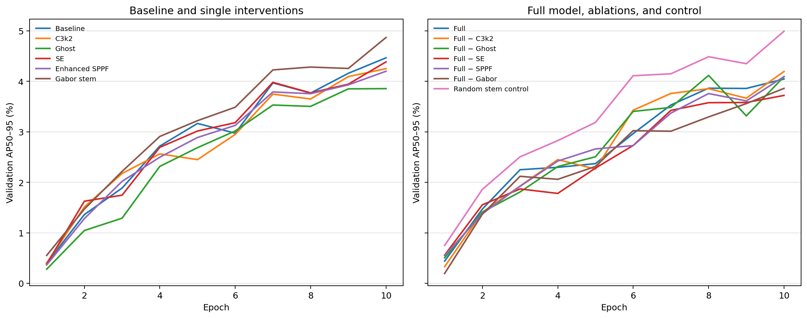
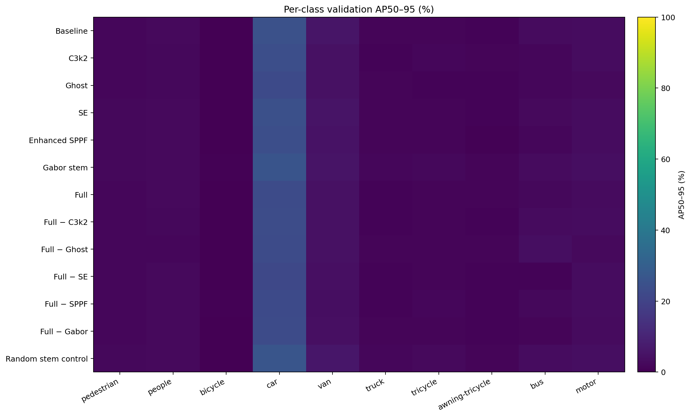
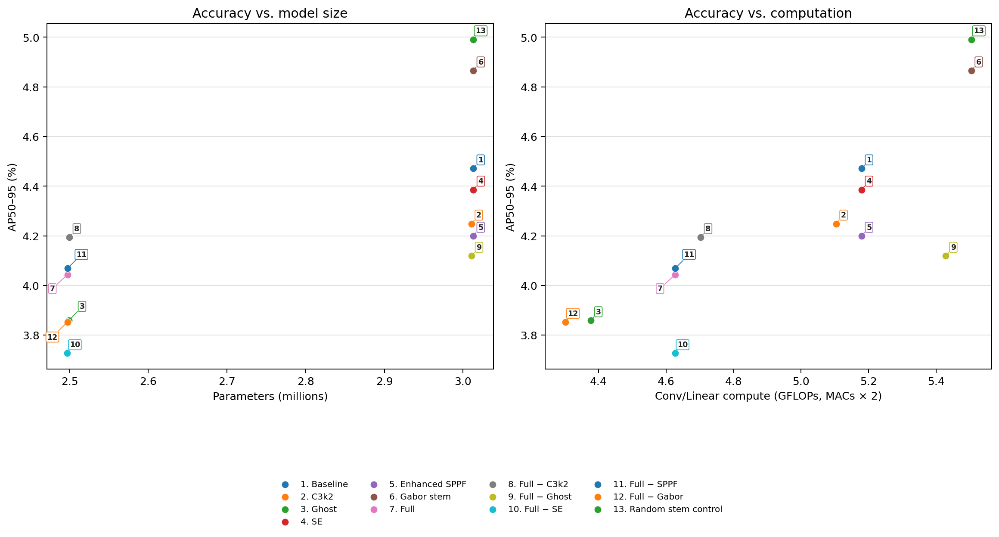

# VisDrone 检测实验报告：pilot

本报告只汇总 `status=completed` 的真实运行记录。AP 数值均为百分数。这里的验证是由 VisDrone 标注转换得到的标准 YOLO 10 类评估；它没有实现官方 VisDrone 评测器对忽略区域的匹配规则，因此不能作为官方 VisDrone DET 榜单成绩。

> Suite 状态：13/13 个预定义变体均已完成。

## 汇总结果

| 变体 | 运行数 | 种子 | Precision (%) | Recall (%) | AP50 (%) | AP50–95 (%) | 参数量 | Conv/Linear GFLOPs¹ | 验证器 inference (ms/图)² |
|---|---:|---|---:|---:|---:|---:|---:|---:|---:|
| Baseline | 1 | 179 | 17.25 | 12.70 | 9.64 | 4.47 | 3.013M | 5.179 | 0.334 |
| C3k2 | 1 | 179 | 15.61 | 12.52 | 9.15 | 4.25 | 3.010M | 5.104 | 0.347 |
| Ghost | 1 | 179 | 13.65 | 11.99 | 8.48 | 3.86 | 2.499M | 4.377 | 0.272 |
| SE | 1 | 179 | 16.03 | 13.33 | 9.45 | 4.39 | 3.013M | 5.179 | 0.335 |
| Enhanced SPPF | 1 | 179 | 25.80 | 12.67 | 9.16 | 4.20 | 3.013M | 5.179 | 0.261 |
| Gabor stem | 1 | 179 | 19.55 | 13.34 | 10.30 | 4.87 | 3.013M | 5.504 | 0.273 |
| Full | 1 | 179 | 18.28 | 11.81 | 8.76 | 4.04 | 2.497M | 4.627 | 0.277 |
| Full − C3k2 | 1 | 179 | 19.03 | 12.55 | 9.08 | 4.19 | 2.500M | 4.702 | 0.285 |
| Full − Ghost | 1 | 179 | 19.45 | 11.79 | 8.51 | 4.12 | 3.011M | 5.429 | 0.345 |
| Full − SE | 1 | 179 | 15.74 | 12.15 | 8.29 | 3.73 | 2.497M | 4.627 | 0.347 |
| Full − SPPF | 1 | 179 | 18.91 | 12.24 | 8.95 | 4.07 | 2.497M | 4.627 | 0.290 |
| Full − Gabor | 1 | 179 | 15.76 | 11.76 | 8.42 | 3.85 | 2.497M | 4.302 | 0.375 |
| Random stem control | 1 | 179 | 19.52 | 13.72 | 10.49 | 4.99 | 3.013M | 5.504 | 0.331 |

表中的 `±` 是多个种子之间的样本标准差。只有一个种子的变体仅报告单次观测值，没有不确定性估计，不能把它解释为稳定的模型差异。

¹ GFLOPs 按 batch 1 的卷积和线性层 MACs×2 计算，包含固定 Gabor 卷积，不包含 BN、池化、激活、解码和 NMS。² inference 是 Ultralytics 验证器在批处理验证过程记录的每图阶段时间，不是隔离环境下的单图端到端延迟。

## 实际运行协议

| 项目 | 运行记录值 |
|---|---|
| Epoch 预算 | 10 |
| 输入尺寸 | 512 |
| Batch | 16 |
| 初始化 | from scratch; no pretrained checkpoint |
| 评估划分 | official validation |
| Checkpoint 选择 | best validation mAP50-95 within fixed epoch budget |

优化器与增强等完整实际参数保存在各运行的 `metrics.json`；suite 的固定调用参数保存在 `protocol.json`。

## 数据与可复现性

类别（源标注 1–10 映射到 YOLO 0–9）：pedestrian、people、bicycle、car、van、truck、tricycle、awning-tricycle、bus、motor。

数据准备清单 SHA-256：`f422f1deb2bc0ab0d57e4345073c100d6cbe99e0fa4933f92a0b1efb42dad818`。

| 划分 | 原始划分 | 原图数 | 使用图数 | 保留框 | 丢弃行 | 裁剪框 | 文件列表 SHA-256 |
|---|---|---:|---:|---:|---:|---:|---|
| train | VisDrone2019-DET-train | 6471 | 2048 | 108340 | 3318 | 0 | `6bef11efd84ef0461ad1541073c408fc85ab0e871c9617d78c70b283732777a0` |
| val | VisDrone2019-DET-val | 548 | 548 | 38759 | 1410 | 0 | `990faae234563e2cf6266ed6a45d7d8b4d5136c97686d2391b048649f49781e8` |

运行记录中的 dataset YAML SHA-256：`f8afdda8102c5da67eabac167cdfda6a3609b33c23d29f38410eaa360f5ae478`

训练代码 SHA-256：`4a228554ca42d5e8dad6414bc91cdfb98c9f5845ccbb6aafdf6d19da64aa5046`。

数据指纹（图像数及图像+标签 SHA-256）：

```json
{
  "train": {
    "image_and_label_sha256": "35691d3decddd9366f16cf90d2877f87472c0fc230f8442fb6951103878a8a3d",
    "images": 2048
  },
  "val": {
    "image_and_label_sha256": "dcfe7073679ec50496683ebdaf9d25a6c69b515fbee4793c9118147d7c4faae7",
    "images": 548
  }
}
```

核心软件环境：`{"packages": {"Pillow": "11.3.0", "numpy": "1.26.4", "torch": "2.9.0.dev20250907+cu128", "torchvision": "0.24.0.dev20250907+cu128", "ultralytics": "8.3.195"}, "python": "3.10.13"}`。

### 运行产物哈希

| 运行 | metrics.json SHA-256 | checkpoint SHA-256 |
|---|---|---|
| baseline_s179 | `d270a3abe072ef947c0538785cb8df805229302c61e8c9db2ddce341b1d5b041` | `1a54fee9dde820d8136e636b247a7746fa1d6874e7cda187a900a3e1da450dd7` |
| c3k2_s179 | `d87a8e0b94fdadf886c1bdaded2cc5028d8a7d098c9dc14d8f0540edeb0a4427` | `f1dad6cb49b8b4305e216f7ad5df65494ca3291a647549f636fbaea30c164e57` |
| ghost_s179 | `41c1cb0688b7ff3b39666e0be36509eeeaa9ac0e2744810279bdcee46e451246` | `e44a1c8d4d2b96b054b52e72c60a629a965fec5b34ca43285dfbccf6c2876066` |
| se_s179 | `67a4dc06d1261dc8b182e662ab2e7d52f978ddcd56c7ccd7679e0043cdc1d82d` | `7c83e1d3caf5e4c2a4423ae0499e723901132ac4cedd2657f6cce8d1c66a3d7d` |
| sppf_s179 | `99f707dee6311d3988c8a6374faffefad223f4b4c64af32d73d0b1178803f661` | `82848a4a7db546d7643cf738ae4d54a1e1e3467b800d56cf1ee1db63f1903a6d` |
| gabor_s179 | `45208875dbcf3eb54c87515c5a6401f4d6d14eb5993c437c736f7a7e18e5e49b` | `e94d075be7aff38d3608b8a01e0da9a709ce3c371ac5a6f84d40e7dd0a46d68e` |
| full_s179 | `95656888924161c97331b8677f310719000e62d534eb95730a62a3608344e6e0` | `a399ce9d890f6a3dc62230140ddbb4abd6b9456b769267b187a51718bbe08958` |
| without_c3k2_s179 | `35da09708df81d39efc40895c04addbca27cf0d521a37062903fb7ffa74a0231` | `12c88932ba1b7001c28dd53c2a592bd9daeecb0d7e621f7ddf9217f845864bb5` |
| without_ghost_s179 | `df38a0d8480e6a4f4c00c4a808cf4c02d934e00f8ff64e2ae751fae2802d91ae` | `6b53b6295c6d753fec35c4d0fa41108253492d33a7f082726fb786ef6fa4b903` |
| without_se_s179 | `5e732b7555d6873490cf12f479b56b83c09ffc6264ffa33c5c837e6b16486e07` | `066fe079dba66a9794e4dca6042a74e25a3778e28690ea6c41c6e8855d0f6aef` |
| without_sppf_s179 | `176eb398cf2ae8775378397baef4e0cf5c4b18cb46fa851521aaf590d3a86e1e` | `1d7e3a82424e6e7061ba7431e8a68551b03c7032205a955f08cef3e259984beb` |
| without_gabor_s179 | `fe3a559327c36989e0f70776ae39fe538208c7b94fe492acb4e6364c1a0c9f24` | `070585d5f546058bdf408e7107c0b6610039fca60448de3800d872e7d79f5c95` |
| random_stem_s179 | `d1e4fb96b1d24f54944b27a105eda65e0e1f74dd104087d0a3a13110a8cb9b1a` | `a6e0da20aaff2996e9c0e63fda170ed004f24dbb124110c5ec3afebc3d8f9758` |

## 自然遮挡召回诊断

遮挡等级来自原始 VisDrone 标注字段。预测置信度阈值为 0.05，NMS IoU 为 0.50；按置信度降序进行类别一致、一对一的 IoU≥0.50 匹配，再按遮挡等级分层。下表是 ground-truth recall，不是 AP，也没有实现官方忽略区域匹配。`n` 是各层合格 GT 数；边界框大小如需分层，按原图像素面积计算（small < 32²、medium < 96²、large ≥ 96²）。

| 变体 | 诊断运行数 | 图像数 | 遮挡 0 Recall (%) | 遮挡 1 Recall (%) | 遮挡 2 Recall (%) |
|---|---:|---:|---:|---:|---:|
| Baseline | 1 | 548 | 36.70 (n=16810) | 21.01 (n=18863) | 10.53 (n=3086) |
| C3k2 | 1 | 548 | 36.04 (n=16810) | 20.67 (n=18863) | 10.86 (n=3086) |
| Ghost | 1 | 548 | 35.28 (n=16810) | 19.86 (n=18863) | 9.79 (n=3086) |
| SE | 1 | 548 | 36.31 (n=16810) | 20.56 (n=18863) | 10.24 (n=3086) |
| Enhanced SPPF | 1 | 548 | 36.82 (n=16810) | 21.43 (n=18863) | 11.05 (n=3086) |
| Gabor stem | 1 | 548 | 37.72 (n=16810) | 21.73 (n=18863) | 11.96 (n=3086) |
| Full | 1 | 548 | 33.55 (n=16810) | 17.61 (n=18863) | 8.04 (n=3086) |
| Full − C3k2 | 1 | 548 | 35.12 (n=16810) | 19.29 (n=18863) | 10.08 (n=3086) |
| Full − Ghost | 1 | 548 | 33.18 (n=16810) | 16.81 (n=18863) | 7.45 (n=3086) |
| Full − SE | 1 | 548 | 35.21 (n=16810) | 19.13 (n=18863) | 9.85 (n=3086) |
| Full − SPPF | 1 | 548 | 35.06 (n=16810) | 19.62 (n=18863) | 10.14 (n=3086) |
| Full − Gabor | 1 | 548 | 34.96 (n=16810) | 19.41 (n=18863) | 8.26 (n=3086) |
| Random stem control | 1 | 548 | 37.94 (n=16810) | 22.45 (n=18863) | 11.96 (n=3086) |

## 图表

### 基线与各单模块比较


### 验证集 AP50–95 学习曲线



### 完整模型、留一消融与随机滤波器对照


### 各类别 AP50–95



### 精度与参数量/计算量关系



### 自然遮挡等级召回率


## 解释限制

所有模型均从随机初始化开始，并在固定但较短的 epoch 预算内训练。这样的试验适合验证代码路径和比较早期学习行为，不能证明模型已经收敛，也不能据此下结论说某个结构在充分训练后一定更优。

单模块试验回答“在基线上加入一个模块”的问题；留一消融回答“从完整组合中移除一个模块”的问题。两者的参照不同。`random_stem` 只用于检验固定 Gabor 滤波器相对同形状随机固定滤波器的作用，单独展示。
